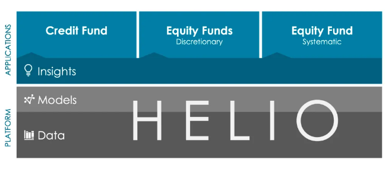
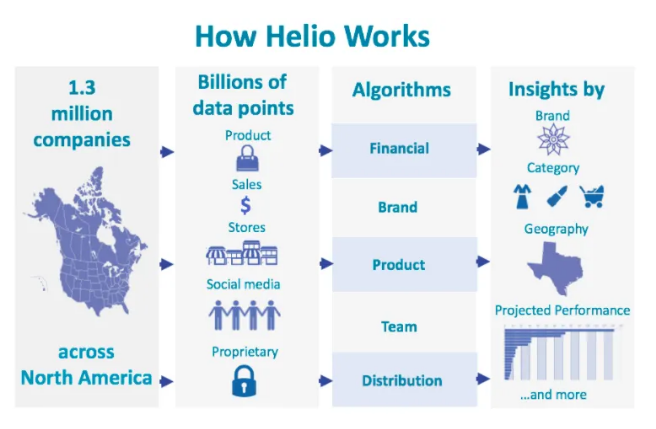
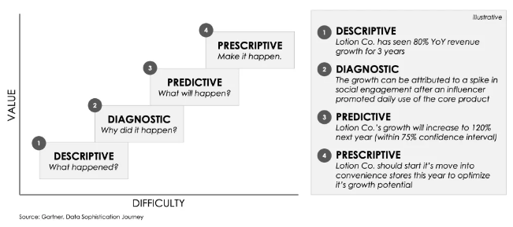
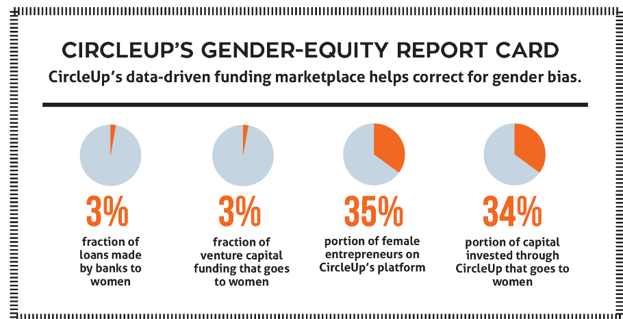

# CircleUP

CircleUp is a financial technology company based in San Francisco, founded in 2011 by Ryan Caldbeck and Rory Eakin but officially launched in 2012. It is an investment platform for entrepreneurs to raise capital and for investors to find companies to fund that are not part of the tech industry with a modern, scalable approach to private markets.  
The original idea behind the company was to expose the majority of hidden small businesses from the investors that are too small for private equity firms or not yet suitable for traditional bank loans. 

CircleUp provides the service to the investor through CircleUp Credit Advisors, CircleUp Growth Partners and Marketplace Index Fund. But the all the three business process is driven by their machine learning platform HELIO that identifies, classifies, and evaluates early-stage consumer and retail companies. 

## 1. Milestone 

2011 

CircleUp raised $1.5 million from investors such as Clayton Christensen, David Topper (ex-head of Equity Capital Markets at JP Morgan) and Maveron (a venture capital firm founded by Howard Schultz). 

2012 

In April 2012 the company officially launched 

2014

Canaan Partners and including previous investors Google Ventures and Union Square Ventures invested $14 million

2015 

Through the Circle UP Growth Fund the company raised $22 million fund. On November 11the led by a venture capital firm Collaborative Fund it announced the Series C funding of $30 million.

2016

CircleUp introduces it's ETF version through the Marketplace Index Fund that gives the investors access to the large portfolio of consumer products companies, which were identified through the company's classifier software Helio.

2017

In July 2017 CircleUp announced the Credit Advisors to issue loans ranging in $25,000 to $600,000 to help businesses fund future purchase orders, increase inventory and smooth out cash flow while waiting on late accounts receivable payment and  Community Investment Manager partnered with CircleUp contributing a $20 million credit facility.

In December CircleUp joined the Nielsen Connected Partner program which allows CircleUp to use Nielsen data for its Helio software.

## 2. BUSINESS ACTIVITIES:

CircleUp primarily focuses on the selling of pieces of consumer companies to investors . It act as an angle network that helps to  provide either loan or fund to the plenty of young consumer products companies with big national brands -- be they food or household products which weren't getting funds from the traditional venture investors. 
It also helps the investor to get comfortable with putting the money into private companies by utilizing social media resources such as Facebook, Linkedin contacts, and showing the performance  of the company through the standardized data gathered by Helio. CircleUp also plays the role of broker/dealer so it can transact shares in a company and take a commission on sales. 

Fig 1. CircleUp Business Model

The business idea behind the company is to bring the bring machine learning to bear on the process of evaluating investments and currently CircleUp is only focused on consumer goods startups not tech because the business models are same, and there are so much data to look at which makes it much easier for an algorithm to handle rather than a sector such as technology. And they achieve their mission through their machine learning platform Helio.  

 
## 2.1 HELIO

Helio is a platform of data and algorithms on top of which CircleUp built their business applications. Helio proactively finds, classifies, and evaluates Consumer packaged goods (CPG) companies on a set of dimensions calibrated for success. It is a knowledge graph for CPG.
Helio address the challenges of not having a centralized source of performance data on companies in the private markets.

    Helio Data Collection

The helio data input basically comes from three different sources -

1) Public Data - Helio draws in billions of publicly available data points on a regular basis, collecting information on things like how customers are responding to content, how the company is describing itself, where the company’s products can be bought or where its stores are located, the work experience of people who are employed at the company, and much more.  

2) Partnership data - Data that are provided by CircleUp partners who share information with the company so that they can have a better understanding of the industry and return insights to them. 

3) Practitioner data - The proprietary information shared by the entrepreneurs business. Helio  use this information — in an aggregated, non-publicly-identifiable way — to improve the models.

The collected data are normalized in order to get an overall picture of the landscape and later the companies are categories into 100 different sectors based on the granularity. The evaluative model which is built on a series of algorithms analyze the various aspects of each company relative to its category. 

Helio is focused on Descriptive, Diagnostic , Predictive and Prescriptive analytics which is define as Gartner’s Data Framework. 

    Gartner's Data Framework

1) Descriptive Analytics

    Helio aggregate the data from the following distrubited source 

    - At unit-level based on the documentation of the transaction of each product item using it's unique identifier (UPC code) 
    
    - Product reviews which add qualitative and quantitative dimension to the data

    - Any information posted on social media for marketing or branding

And finally using aggregated data on distribution, brand, and team, Helio creates an accurately descriptive map of the industry which gives the full picture of the companies details.

2) Diagnostic Analytics

The key to diagnostic analysis (the why) is access to historical time series data in combination with algorithmic analysis. Historical data first explains how things have (or haven’t) changed so that algorithms can better explain why things have changed. Understanding the why provides a repeatable and scalable success to make an investment decision.

3)  Predictive Analytics

The predictive analytics is more align to know what will likely happen than what already happened. Helio has several predictive elements, including future product distribution.
With predictive insights retailers can stay ahead of trends, entrepreneurs can move into a growing category with confidence, and investors can invest based on quantifiable future potential rather than just historical metrics.

4) Prescriptive Analytics

It is to find the winning formula by setting strategy or tactics based on algorithmic prescriptive insights. As for example if certain data can help an entrepreneur to differentiate their ingredient list, determine the best package size, and redirect their distribution strategy. 

## 3. CircleUp vs TRADITIONAL FINANCE  

The primary sources of initial financing for new businesses are:
personal and family savings, bank business loans, and personal credit
cards. Entrepreneurs also tap other sources of funding along their journeys. These other sources—including venture capital, angel investments, and,more recently, crowdfunding.

The new generation of lending and crowdfunding platforms are marketplaces that help the two sides of the transaction (funder and funded, or creditor and debtor) by standardizing the process and helping with marketing and legal materials. They are mostly utilizing enhanced processes powered by data analytics, offering seamless process steps between subscription, data collection, and analysis. Many players that are developing lending platforms aim to simplify the process and reduce the lending time (from loan application to disbursement). FundesClub has invested more than $27 million and funded 108 companies to date, similarly BacktoWork 24, StartEngine, Fundraise.com are few other fintech firms which are taking traditional venture capital investment to the next level.   

## 4. CircleUP IMPACT

The major investor of CircleUp are Union Square Ventures, Canaan Partners, QED Investor, Rose Park, Maveron and Google Ventures. At present has helped 256 companies such as Atlas, Banza, Artis, Better bean and many more. They have also tackle the funding gap that plagues female entrepreneurs and raised more than $390 million dollars in funding from its network of over 20,000 accredited investors. 

On comparing the CircleUp with it's major competitors, it is focused on a single industry (consumer packaged goods, or CPG), a single stage (emerging brands), single geography (North America), and two asset classes (equity and credit). 
The potential advantages are, the companies seeking the fund can connect with experienced, knowledgeable investors of the industry, who can potentially help you grow the company faster and provide one-on-one guidance. They can also get access to CircleUp’s network of operational partners, like Johnson & Johnson and eBay, who can share business expertise and potentially help with product development and manufacturing. 
CircleUp appears best suited for high-growth companies in the retail and consumer product sectors.Companies looking for the fund should have at least $500,000 in annual revenue, and they must focus on an innovative consumer product and/or retail brand.

## 5. REFERENCES 

1. https://circleup.com/
2. https://circleup.com/blog/
3. https://www.forbes.com/sites/alexkonrad/2019/09/19/circleup-raises-200-million-for-startup-loans/#3694afab65fd
4. https://en.wikipedia.org/wiki/CircleUp
5. https://craft.co/circleup/competitors
6. https://consciouscompanymedia.com/sustainable-business/finance-capital/circleup-equitable-way-find-investors/
7. https://www.nerdwallet.com/blog/small-business/small-business-success-story-smri-organics-circleup/
8. https://www.crunchbase.com/organization/circleup-growth-partners#section-investors
9. https://www.forbes.com/sites/kristinstoller/2018/02/13/forbes-fintech-50-2018-the-future-of-investing/#4dc649b22532
10. https://blog.crowdfunder.com/infographics/the-history-of-crowdfunding/
11. https://hackernoon.com/6-trends-to-redefine-the-future-of-crowdfunding-b41ca91739ad 
12. https://techcrunch.com/2017/07/26/circleup-credit-advisors/
13. https://www.businessinsider.com/andy-weissman-union-square-ventures-circleup-2016-9

